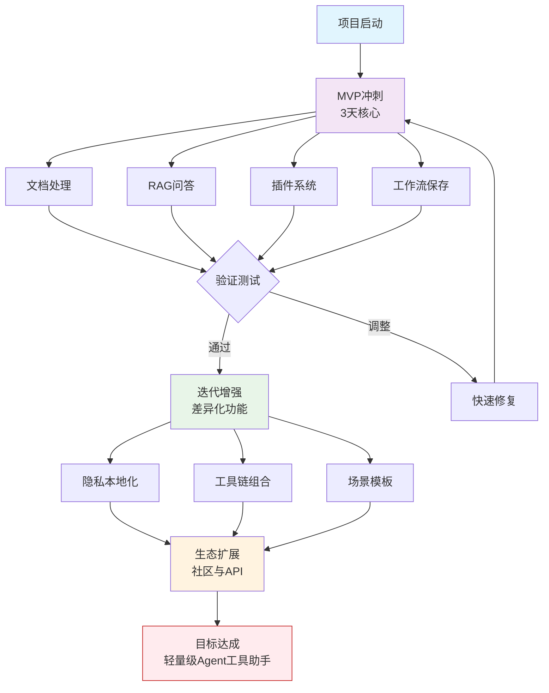

# open-productivity-agent
轻量级 AI 代理工作台（Agent Workspace）

    为什么？  

        符合“开源 × 超级个体生产力工具”赛道  
        利用工作流经验 + 工程能力  
        不需要复杂 UI，重点在功能组合 + 自动化

✨ 核心功能（MVP 版，3 天可出）：

    上传文档（PDF/Word/TXT）→ 自动解析 + 向量化存储（用 LangChain + Chroma）
    对话问答 → 基于文档内容回答（RAG）
    插件式工具（可选）：
        实时搜索（用 SerpAPI 或 Bing）
        简单记账/待办（结构化输出）
        网页内容摘要（URL 输入）
    工作流保存 → 用户可保存“智能体配置”（类似 Dify 的轻量版）

    💡 差异化点：  

        开源 + 本地可部署（强调隐私/可控）  
        支持“工具链自由组合”（比单一聊天更灵活）  
        针对自由职业者/学生/研究者（超级个体）

## 参考文档: https://shanghaiopen.feishu.cn/wiki/BBClwNHPeiUfntkhNGucvoftnCf

- 项目简介
- 快速开始
- 安装部署指南
- 使用示例
- API文档（如有）
- 贡献指南
- 许可证信息
